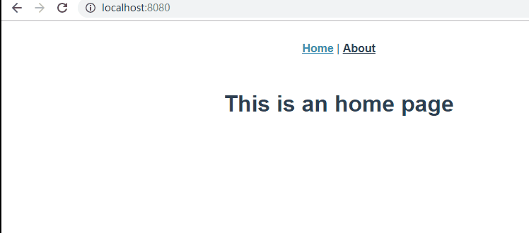

## 简介

Vue Router 是 Vue.js 官方的路由管理器。它和 Vue.js 的核心深度集成，让构建单页面应用变得易如反掌

## Vue-Router的使用

#### 安装

`vue add router`

#### 配置

使用vue-router插件，router.js

```
import Router from 'vue-router'
Vue.use(Router)
```

创建Router实例，router.js

```
const routes = [
  {
    path: '/',
    name: 'home',
    component: Home
  },
  {
    path: '/about',
    name: 'about',
    component: () => import('../views/About.vue')
  }
]

const router = new VueRouter({
  mode: 'history',
  base: process.env.BASE_URL,
  routes
})

export default router
```

在根组件上添加该实例，main.js

```
...
import router from './router'

new Vue({
  router,
  ...
}).$mount('#app')
```

添加路由视图，App.vue

```
<div id="nav">
  <router-link to="/">Home</router-link> |
  <router-link to="/about">About</router-link>
</div>
<router-view/>
```

实现效果如下



## router任务分析

1. 实现vue插件
2. 解析routes选项
3. 监控url变化
   - html5 history api  /login
   - hash  xx.html/#/login
4. 实现两个全局组件
   - router-link
   - router-view

## 手写简版vue-router

#### Hash模式

创建my-vue-router.js

```
// 
let Vue;  // 保存use传入的Vue构造函数
class MyVueRouter {
  constructor(options){
    this.$options = options

    this.routeMap = {}  // {'/index': {component: Index, ...}}

    // 当前url需要是响应式的
    this.app = new Vue({
      data: {current: '/'}
    })
  }
  // 初始化
  init(){
    // 监听事件
    this.bindEvents()
    // 解析routes
    this.createRouteMap()
    // 声明组件
    this.initComponent()
  }

  bindEvents(){
    // 这里实现的是Hash的模式
    window.addEventListener('hashchange', this.onHashchange.bind(this))
  }
  onHashchange(){
    // 截取#号后面
    this.app.current = window.location.hash.slice(1) || '/'
  }
  createRouteMap(){
    // 遍历用户配置的路由数组
    this.$options.routes.forEach(route=>{
      this.routeMap[route.path] = route
    })
  }
  initComponent(){
    // 转换目标：<a href="/">xxx</a>
    // <router-link to="/"/>
    Vue.component('router-link', {
      props: {
        to: String
      },
      render(){
        // 使用createElement, h(tag, data, children)
        /* return h('a', {
          attrs: {href: '#' + this.to}
        }, [this.$slots.default]) */

        // 使用JSX
        return <a href={'#' + this.to}>{this.$slots.default}</a>
      }
    })

    // 获取path对应得Component将它渲染出来
    Vue.component('router-view', {
      render: h=>{
        var component = this.routeMap[this.app.current].component; 
        return h(component)
      }
    })
  }
}

//Vue.js 的插件应该暴露一个 install 方法。这个方法的第一个参数是 Vue 构造器，第二个参数是一个可选的选项对象————引自Vue.js官网
// 参数是Vue的构造函数
MyVueRouter.install = function(_Vue){
  Vue = _Vue
  // 实现一个混入
  Vue.mixin({
    beforeCreate(){
      // 获取MyVueRouter实例并挂载到Vue.prototype
      if(this.$options.router){
        // 根组件beforeCreate时执行一次
        Vue.prototype.$router = this.$options.router
        // 路由器初始化
        this.$options.router.init()
      }
    }
  })
}

export default MyVueRouter;
```

#### History模式

